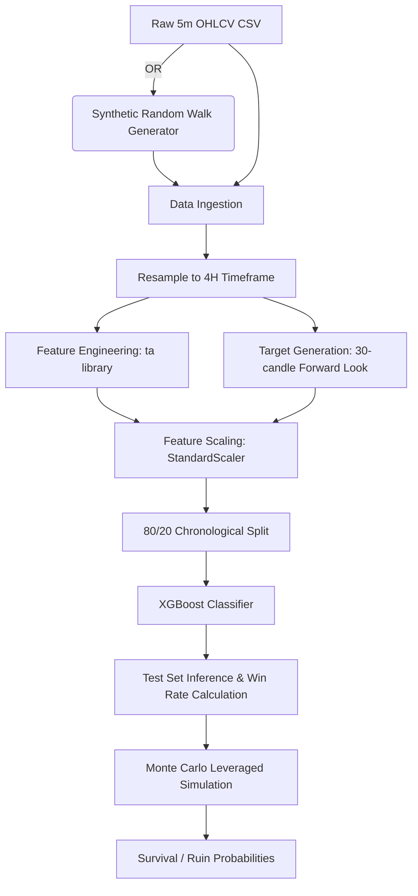

# 02. High-Level Architecture

## System Design
The repository is structured as a collection of decoupled simulation and validation scripts rather than a cohesive trading system. There is no central data pipeline, no shared utility libraries, and no live execution modules.

The architecture is divided into three distinct silos:

1. **Stochastic Hedging Simulator (`2_options_hedged_scalper.py`)**
   - A pure mathematical simulation engine.
   - Requires no external data.
   - Uses parameterized constants (win rate, edge, insurance cost) to compute survival probabilities.

2. **ML Validation Pipeline (`3_cross_asset_validation.py`)**
   - An end-to-end data processing and machine learning script.
   - Handles everything from data ingestion (or synthetic generation) to feature engineering, model training, inference, and backtesting within a single monolithic function.

3. **Robustness Analysis (`robustness_teardown.ipynb`)**
   - An isolated analytical environment for post-trade or theoretical statistical testing (bootstrapping, sensitivity analysis).

## Data Flow Diagram

## Module Explanations

- **Data Generator:** A fallback mechanism in the cross-asset validator that generates synthetic price data using cumulative normal distributions if real CSV files are missing.
- **Resampler:** Converts high-frequency (5m) data into lower-frequency (4H) representations to reduce noise and align with the intended strategy timeframe.
- **TA Feature Extractor:** A brute-force module that calculates all available technical indicators from the `ta` library, expanding the feature space significantly.
- **Target Labeler:** Iterates through future candles to label historical states as successful (1) or unsuccessful (0) trades based on fixed percentage thresholds.
- **Monte Carlo Engines:** Present in multiple files, these loops simulate thousands of potential portfolio equity trajectories based on fixed probabilities and constraints to estimate path-dependent ruin.
- **Statistical Bootstrapper:** Present in the Jupyter Notebook, it resamples synthetic return distributions to calculate non-parametric confidence intervals for Expected Value and Win Rate.
